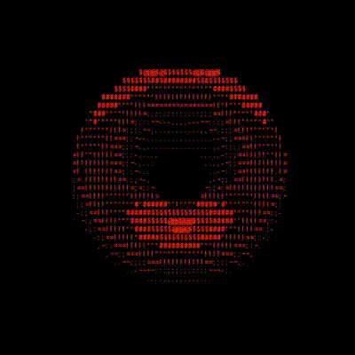

 # Portfolio 

### Some Python things

- [django](https://github.com/fjasic/django)
- [my bsc about decoding signals from oscilloscope](https://github.com/fjasic/bsc)
- [jupyter books on deep learning](https://github.com/fjasic/duusaiu)
- [algorithms done in python](https://github.com/fjasic/pa)

---
### Some devops stuff

- [github actions collection](https://github.com/fjasic/gh_actions)
- [custom github action](https://github.com/fjasic/react-app)
- [github action for artifactory deployment](https://github.com/fjasic/workflow_push_to_artifactory)

---
### academic projects

- [verilog and systemverilog stuff](https://github.com/fjasic/uvm)
- [game for FPGA board done in C](https://github.com/fjasic/simonsaysrpi)
- [p2p encrypted network done in C](https://github.com/fjasic/p2pnetwork)
- [image interpolation done in C++](https://github.com/fjasic/imageinterpolation)
- [android chat app done in Java](https://github.com/fjasic/chatapplication)
- [noise generator & remover done in C](https://github.com/fjasic/dsp1projekat)
